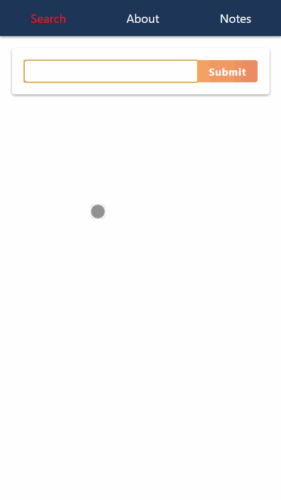
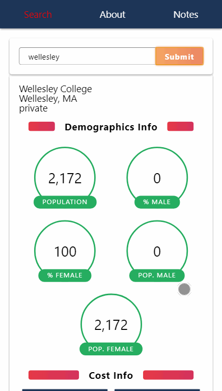

# 100 Days Of Code - Log

### Day 1: April 23, 2017 - College Checklist

Starting back from the begining on this. I got bad about tweeting, and especially logging my stuff. I was coding during that time - just not doing the whole social media thing.

That being said, I spent today working on my college visit tracking application. Had a lot of trouble styling the bubbles, but I finally got it! I also started digging into the CS50 class on EDx. I want to round out my CS knowledge and this seems like the best way to do it.

**Link to Work:** [College Checklist](https://github.com/leo-generali/college-checklist)

### Day 1: April 24, 2017 - College Checklist

More time spent with my college application - this time working with Flexbox to get the cost of the school displayed. Still not one hundred percent sure I love the card format for the price but it'll do for now.

**Link to Work:** [College Checklist](https://github.com/leo-generali/college-checklist)
